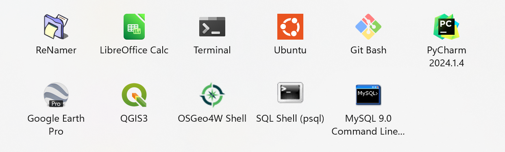

# 2. Software 

---




## Mapping    
- [ ] [QGIS](https://qgis.org/en/site/forusers/download.html) (+ OSGeo4W/gdal, PostGIS/postgreSQL)
- [ ] [Google Earth Pro](https://support.google.com/earth/answer/21955?hl=en)
- [ ] [Geoserver](https://geoserver.org/download/) (requires [JDK](https://adoptium.net/) )

## Relational Database Management System (RDBMS) 
*NOTE [different SQL syntax](https://www.datacamp.com/blog/sql-server-postgresql-mysql-whats-the-difference-where-do-i-start?utm_source=google&utm_medium=paid_search&utm_campaignid=19589720830&utm_adgroupid=152984016694&utm_device=c&utm_keyword=&utm_matchtype=&utm_network=g&utm_adpostion=&utm_creative=684592141394&utm_targetid=dsa-2222697809758&utm_loc_interest_ms=&utm_loc_physical_ms=9031757&utm_content=DSA~blog~SQL&utm_campaign=230119_1-sea~dsa~tofu_2-b2c_3-us_4-prc_5-na_6-na_7-le_8-pdsh-go_9-nb-e_10-na_11-na&gad_source=1&gclid=Cj0KCQjws560BhCuARIsAHMqE0FYrjbIuukzGe7GNZ6eeFyRIdojfvbJMp5LreGIjlWsex3WJJ9k5aMaAvSLEALw_wcB)*    
- [ ] [postgreSQL](https://www.postgresql.org/download/) (w/ postGIS plugin to connect to QGIS)  
- [ ] [MySQL](https://dev.mysql.com/downloads/mysql/) *NOTE: Select your OS*
- [ ] [SQL Server](https://www.microsoft.com/en-us/sql-server/sql-server-downloads)
- [X] SQLite (sqlite3 pre-installed with Python)
- [ ] [ESRI file geodatabase (.gdb)](https://pro.arcgis.com/en/pro-app/latest/help/data/geodatabases/manage-file-gdb/file-geodatabases.htm)

## Scripting
- [ ] [Python](https://www.python.org/downloads/) 
  - *Personal preference: For large-scale data processing & analysis*
- [ ] [R](https://rstudio-education.github.io/hopr/starting.html) 
  - *Personal preference: For easier small-scale statistics/tabular analysis & data visualization*

## Virtual Environment
- [X] venv (pre-installed with Python)
- [ ] [Anaconda](https://www.anaconda.com/download/success)
  - *Pro: easy GDAL install*
  - *Con: slower to install packages, though [Micromamba](https://mamba.readthedocs.io/en/latest/installation/micromamba-installation.html) is a lightweight alternative* 

## Integrated Development Environment (IDE)  
- [ ] [PyCharm](https://www.jetbrains.com/pycharm/download/)
- [ ] [Spyder](https://www.spyder-ide.org/)   
- [X] Jupyter Lab (install from activated virtual environment with Python)
- [ ] [RStudio](https://posit.co/downloads/)  

## Version Control  
- [ ] [Git](https://git-scm.com/downloads)  


### Install notes:
* *When installing & setting up application, choose the custom setup (but probably use defaults) to see where files are placed, what is installed, etc.*  
* *Remember to delete app_installer.exe file from Downloads folder after install is complete*   


#### Linux & Windows PATH variable

PATH environment variable is a list of folders where the terminal looks to run a program.
* when installing an application, or {app} such as python, anaconda (NOT RECOMMENDED), or Git, select 'Add {app}.exe to PATH' to add the python install location to your user's 
* otherwise, manually add the application to path by adding that program's install location to the PATH variable:

~~~
echo export PATH="{path_to_python}:$PATH" >> ~/.profile
~~~

Mac:   
i) open the terminal and enter the following command on a Mac: ```sudo nano /etc/paths``` (enter user password when prompted)  
ii) in the last row of the file enter your app's install location, ex: /Library/PostgreSQL/16/bin  


---


## QGIS 

### Add basemaps:  
1) In the <b>Browser</b> pane: under <b>XYZ Tiles</b>, right-click and select <b>New Connection</b> 
2) Enter the Name and URL from a row in the table below into the <b>XYZ Connection</b> popup window. 


| Name               | URL                                                                                             |
|--------------------|-------------------------------------------------------------------------------------------------|
| ESRI World Imagery | https://services.arcgisonline.com/arcgis/rest/services/World_Imagery/MapServer/tile/{z}/{y}/{x} |
| Bing Aerial        | http://ecn.t3.tiles.virtualearth.net/tiles/a{q}.jpeg?g=1                                        |
| Google Satellite   | https://mt1.google.com/vt/lyrs=s&x={x}&y={y}&z={z}                                              |
| Google Hybrid      | https://mt1.google.com/vt/lyrs=y&x={x}&y={y}&z={z}                                              |
| Open Topo          | https://tile.opentopomap.org/{z}/{x}/{y}.png                                                    |

3) To view, drag the new connection (has a grid symbol & located under <b>XYZ Tiles</b>) to the Map pane.

### Add open-source tool plugins:
<b>Plugins</b> dropdown > <b>Manage and Install Plugins</b> > search for your plugin     


---

## [ESRI Ecosystem](https://www.esri.com/en-us/arcgis/products/index)

[ESRI Developer](https://developers.arcgis.com/)

### 1) [ArcGIS Pro](https://www.esri.com/en-us/arcgis/products/arcgis-pro/overview)

### 2) [ArcGIS Enterprise](https://www.esri.com/en-us/arcgis/products/arcgis-enterprise/overview)  Software Components:
  1) ArcGIS Server
  2) ArcGIS Enterprise portal
  3) ArcGIS Data Store
  4) ArcGIS Web Adaptor

### 3) [ArcGIS Online](https://www.esri.com/en-us/arcgis/products/arcgis-online/overview) (AGOL) Components: 

#### [Data Management](https://doc.arcgis.com/en/arcgis-online/manage-data/data-in-online.htm)

#### [Data Analysis](https://doc.arcgis.com/en/arcgis-online/analyze/perform-analysis-mv.htm)

#### [Content Creation](https://doc.arcgis.com/en/arcgis-online/create-maps/create-maps-and-apps.htm)

* <b>Web Maps</b>  
   1. create map: [choose basemap](https://doc.arcgis.com/en/arcgis-online/create-maps/choose-basemap-mv.htm), [add layers](https://doc.arcgis.com/en/arcgis-online/create-maps/add-layers-mv.htm), [apply styles](https://doc.arcgis.com/en/arcgis-online/create-maps/apply-styles-mv.htm), [configure popups](https://doc.arcgis.com/en/arcgis-online/create-maps/configure-pop-ups-mv.htm)
   2. [set map properties](https://doc.arcgis.com/en/arcgis-online/create-maps/set-map-properties-mv.htm): [add bookmark](https://doc.arcgis.com/en/arcgis-online/create-maps/bookmark-mv.htm), [configure feature search](https://doc.arcgis.com/en/arcgis-online/create-maps/configure-feature-search.htm), [disable editing](https://doc.arcgis.com/en/arcgis-online/create-maps/disable-editing-mv.htm), tags, description, metadata, etc. 
   3. [set layer properties](https://doc.arcgis.com/en/arcgis-online/create-maps/set-layer-properties.htm)
   4. [save map](https://doc.arcgis.com/en/arcgis-online/create-maps/save-maps-mv.htm)
   5. [share map](https://doc.arcgis.com/en/arcgis-online/share-maps/share-maps-mv.htm)  


* <b>Scenes</b> can be created from AGOL [Scene Viewer](https://www.arcgis.com/home/webscene/viewer.html) or ArcGIS Pro:
   1. choose [global or local](https://doc.arcgis.com/en/arcgis-online/create-maps/choose-global-local-scene.htm)
   2. [add layers](https://doc.arcgis.com/en/arcgis-online/create-maps/add-layers-to-scene.htm) 
   3. [set properties](https://doc.arcgis.com/en/arcgis-online/create-maps/set-scene-properties.htm)
   4. [configure feature search](https://doc.arcgis.com/en/arcgis-online/create-maps/configure-feature-search-scene.htm)
   5. [save scene](https://doc.arcgis.com/en/arcgis-online/create-maps/save-scene.htm)
   6. [share scene](https://doc.arcgis.com/en/arcgis-online/share-maps/share-scenes.htm)  
    

* <b>Web Apps</b> can be created from [maps](https://doc.arcgis.com/en/arcgis-online/create-maps/create-map-apps.htm), [scenes](https://doc.arcgis.com/en/arcgis-online/create-maps/create-app-in-a-scene.htm), or [groups](https://doc.arcgis.com/en/arcgis-online/create-maps/create-gallery-apps.htm) and need to be [shared](https://doc.arcgis.com/en/arcgis-online/share-maps/share-apps.htm): 
   - <b>[Dashboards](https://www.esri.com/en-us/arcgis/products/arcgis-dashboards/resources)</b> - [best practices](https://doc.arcgis.com/en/dashboards/latest/reference/create-web-maps-for-dashboards.htm)
     1. [add actions](https://doc.arcgis.com/en/dashboards/latest/create-and-share/actions.htm), [selectors](https://doc.arcgis.com/en/dashboards/latest/create-and-share/selectors.htm)/triggers
     2. [design view settings](https://doc.arcgis.com/en/dashboards/latest/create-and-share/dashboard-settings.htm)
     3. [share](https://doc.arcgis.com/en/dashboards/latest/create-and-share/dashboard-urls.htm)
   - <b>[Instant Apps](https://www.esri.com/en-us/arcgis/products/arcgis-instant-apps/resources)</b>     
     1. [choose template](https://doc.arcgis.com/en/instant-apps/latest/create-apps/app-templates-overview.htm)
     2. [configure](https://doc.arcgis.com/en/instant-apps/latest/customize/configuration-overview.htm)
     3. [publish](https://doc.arcgis.com/en/instant-apps/latest/customize/publish-draft-updates.htm) 
   - <b>[StoryMaps](https://www.esri.com/en-us/arcgis/products/arcgis-storymaps/resources)</b>
     1. [create](https://doc.arcgis.com/en/arcgis-storymaps/author-and-share/add-narrative-text.htm): add narative text, media, maps, slideshows, tours, etc.
     2. [design](https://doc.arcgis.com/en/arcgis-storymaps/author-and-share/create-a-theme.htm): create theme, change story cover, add story navigation, credits, etc.   
     3. [publish](https://doc.arcgis.com/en/arcgis-storymaps/author-and-share/publish-a-story.htm)
   - <b>[Experience Builder](https://doc.arcgis.com/en/experience-builder/latest/get-started/what-is-arcgis-experience-builder.htm)</b> - [FAQs](https://doc.arcgis.com/en/experience-builder/latest/get-started/faq.htm)
     1. [sign-in](https://experience.arcgis.com/page/landing)   
     2. [create experience](https://doc.arcgis.com/en/experience-builder/latest/get-started/create-your-first-web-experience.htm): choose theme, set data source, refine layout, [configure widgets](https://doc.arcgis.com/en/experience-builder/latest/configure-widgets/widgets-overview.htm), [add page](https://doc.arcgis.com/en/experience-builder/latest/build-apps/add-a-page.htm)
     3. [save, preview & publish](https://doc.arcgis.com/en/experience-builder/latest/build-apps/save-preview-publish.htm)
     
  
* <b>[Notebooks](https://doc.arcgis.com/en/arcgis-online/create-maps/create-a-notebook.htm)</b> can be [created](https://doc.arcgis.com/en/arcgis-online/create-maps/create-a-notebook.htm) or uploaded from your computer as an ```.ipynb``` file
   1. [specify runtime](https://doc.arcgis.com/en/arcgis-online/create-maps/specify-the-runtime-of-a-notebook.htm)
   2. features: [schedule tasks](https://doc.arcgis.com/en/arcgis-online/create-maps/prepare-a-notebook-for-automated-execution.htm), [add python code snippets](https://doc.arcgis.com/en/arcgis-online/create-maps/use-python-code-snippets.htm), [publish as a web tool](https://doc.arcgis.com/en/arcgis-online/create-maps/publish-a-notebook-as-a-web-tool.htm)
   3. [share notebook](https://doc.arcgis.com/en/arcgis-online/share-maps/share-a-notebook.htm)    


#### [Content Sharing](https://doc.arcgis.com/en/arcgis-online/share-maps/share-maps-apps.htm):
- Choose content sharing level (with your group, organization, or everyone).
- To [share items](https://doc.arcgis.com/en/arcgis-online/share-maps/share-items.htm), a user must have appropriate permissions to share content.
- Feature layers and content must be made public to share with public. 
    - Ex: When you create an app using ArcGIS Configurable Apps, you can authorize its subscriber content in the configuration pane by confirming the layers to allow for public use.

### License Management & [Credits](https://doc.arcgis.com/en/arcgis-online/administer/credits.htm)

1. [Manage ArcGIS Pro Licenses](https://desktop.arcgis.com/en/license-manager/latest/welcome.htm)
   * ArcGIS Pro [license types](https://pro.arcgis.com/en/pro-app/latest/get-started/licensing-arcgis-pro.htm): named user (default),  single-use, [concurrent use](https://pro.arcgis.com/en/pro-app/latest/get-started/concurrent-use-licenses.htm)  
2. [ArcGIS Enterprise](https://desktop.arcgis.com/en/license-manager/latest/introduction-to-license-manager-with-arcgis-enterprise-portal.htm) is licensed per user and by system capacity. Users are licensed based on user types, providing secure access to information and content creation capabilities.
   - ArcGIS Server can be licensed in a variety of roles, depending on the capabilities you want to enable for your deployment. Server licensing roles define the capabilities of each ArcGIS Enterprise server machine or site. 
3. [ArcGIS Online](https://doc.arcgis.com/en/arcgis-online/administer/manage-licenses.htm)


ESRI products are licensed based on user types. What tasks each member in an organization is allowed to perform on ESRI products depend on a combination of the following interrelated factors: 
* [User types](https://doc.arcgis.com/en/arcgis-online/administer/user-types-orgs.htm) determine the number of credits and privileges that can be granted to the member through a default role or custom role. User types include the following: Viewer, Contributor, Mobile Worker, Creator, Professional
* [Roles](https://doc.arcgis.com/en/arcgis-online/administer/member-roles.htm) define the set of privileges assigned to a member. Default roles include the following: Viewer, Data Editor, User, Publisher, Facilitator, Administrator  
* [Privileges](https://doc.arcgis.com/en/arcgis-online/administer/privileges-for-roles-orgs.htm) allow members to perform various tasks in an organization, and are defined by their role. Organization administrator can change privileges of custom roles, not default roles. 
