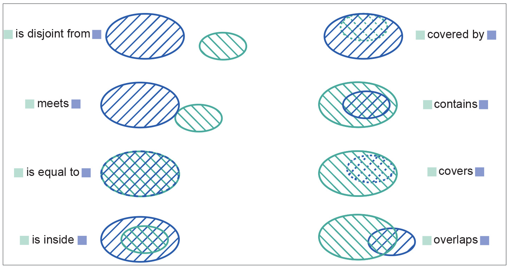
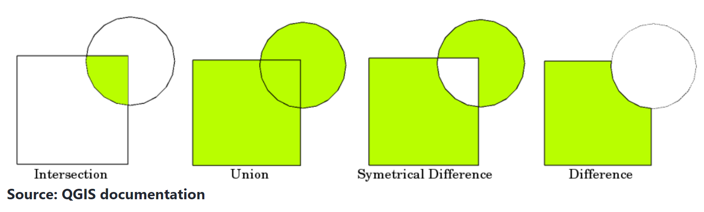

# 5. Geospatial Analysis

*UNDER CONSTRUCTION*

---


## 1st 'Law' of Geography 
"everything is related to everything else, but near things are more related than distant things." - Walder Tobler
* *not a scientific law, more of a starting point for thinking about why things are happening where*

## Spatial Autocorrelation
Spatial autocorrelation measures how similar values of a variable are relative to how close they are. 
- Moran's I: Values range from -1 to +1, such that -1 would represent a checkerboard pattern and values near +1 would represent elevation in flat regions.  
- Geary's C 
- Local Indicators of Spatial Association (LISA)   

## Topological Relations
- disjoint  / intersects 
- is equal to
- contains / within 
- overlap with 


## Set Operations


## Clip
- Keeps only part of a raster or vector that intersects with the clipping shape 

## Buffer 
- Add or subtract buffer distance to points, lines, or polygon vectors

## Point Pattern Analysis
- [Avg Nearest Neighbor](https://pro.arcgis.com/en/pro-app/latest/tool-reference/spatial-statistics/h-how-average-nearest-neighbor-distance-spatial-st.htm) 
- Kernel Density Estimation  
- Convex Hull: Minimum bounding geometry from common points    
- [Ripley's K](https://pro.arcgis.com/en/pro-app/latest/tool-reference/spatial-statistics/h-how-multi-distance-spatial-cluster-analysis-ripl.htm): Point Clustering at different search distances / bandwidths
- [Getis Ord D](https://pro.arcgis.com/en/pro-app/latest/tool-reference/spatial-statistics/h-how-hot-spot-analysis-getis-ord-gi-spatial-stati.htm): Hot Spot / Cold Spot Analysis 

## Interpolation 
Estimate a value at a location based on surrounding locations (over time or [space](https://pro.arcgis.com/en/pro-app/latest/tool-reference/spatial-analyst/understanding-interpolation-analysis.htm#:~:text=Interpolation%20predicts%20values%20for%20cells,chemical%20concentrations%2C%20and%20noise%20levels.)) 
* methods: nearest neighbor, bilinear, cubic resampling methods for reprojecting rasters (NN basic/fastest -> cubic most intensive)  
* Inverse Distance Weighted ([IDW](https://pro.arcgis.com/en/pro-app/latest/tool-reference/3d-analyst/idw.htm)) - less weight is given to point values further away      
* [Kriging](https://pro.arcgis.com/en/pro-app/latest/tool-reference/3d-analyst/how-kriging-works.htm) - first derivative describes the rate that values change over a distance, or the effect of distance on the attribute, and is used to interpolate unknown locations across space   

## Global statistics
- Band (```b```) algebra: ```b1 + b2```
- Threshold/mask

## Filters   
Require user-input kernel size/radius/distance for the moving window calculation   
- <b>Low-pass filter</b>: Smooths surface
- <b>High-pass filter</b>: Edge-enhancement / sharpening 

## Descriptive Analytics
- <b>Central tendency</b>: mean, median, mode   
- <b>Dispersion</b>: range, variance, standard deviation    
- <b>Distribution visualization</b>: histogram, bar chart, box plot   

## Predictive Analytics
Predicts future or past value based on known (often time-series) values

<b>Regression</b>:   
- Ordinary Least Squares (OLS)   
- Spatial Lag Model 
- Spatial Error Model 
- Geographic Weighted Regression (GWR)  

<b>Clustering</b>:  
- DBSCAN
- K-means
- Principal Component Analysis (PCA) 

<b>Supervised Classification</b>:
- Random Forest (RF)  
- Support Vector Machine (SVM)   

<b>Deep Learning</b>:
- Neural Networks (NN) for image segmentation / object identification   
  - ex) Meta AI Segment Anything Model ([SAM](https://samgeo.gishub.org/))  
  - ex) [cultionet](https://github.com/jgrss/cultionet)  

## Prescriptive Analytics
Suggests decision options for how to take advantage of a future opportunity or mitigate a future risk, and shows the implication of each decision option. 
- <b>Site Suitability Analysis</b> (SSA)   
  - Multi-Criteria Decision Analysis (MCDA)   
  - Analytical Hierarchy Process (AHP)  
- <b>[Vehicle routing](https://developers.arcgis.com/python/guide/part1-introduction-to-network-analysis/)</b>:
  - Service Area: Travel times to customer. For example) to decide where to put fire station. regular buffer, cost over surface (elevation/slope), network (street travel time)
  - Find closest facility for incidents 
  - An [origin-destination (OD) cost matrix](https://developers.arcgis.com/python/guide/part5-generate-od-cost-matrix/) from multiple origins to multiple destinations, is a table that contains the cost, such as the travel time or travel distance, from each origin to each destination
  - Location Allocation: be far from competition but near customers 
  - [Vehicle Routing Problem](https://developers.arcgis.com/python/guide/part7-vehicle-routing-problem/) goal is to best service the orders and minimize the overall operating cost for the fleet of vehicles   
      - starts with OD cost matrix, iterates adds real-world heuristics 

